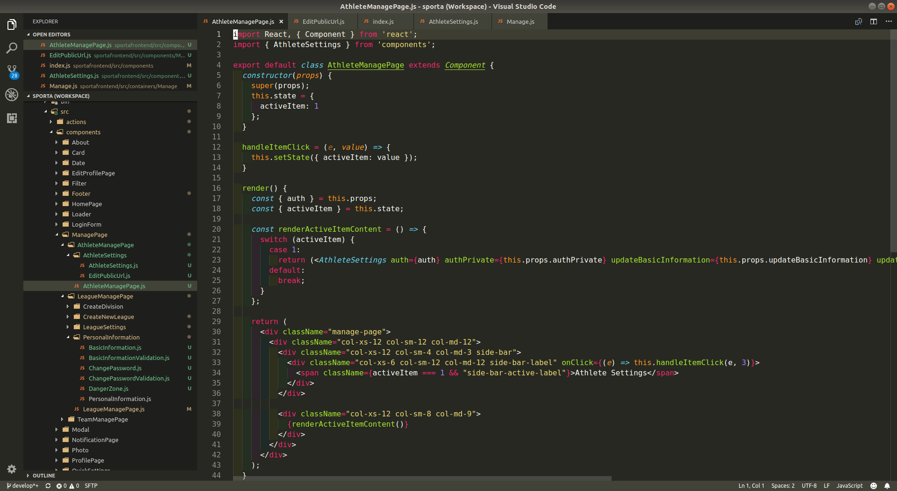

# My VSCode Setup

This repository contains my personal configuration for the awesome and extensible Visual Studio Code editor. Here, I keep an updated list of extensions I find useful for my workflow. In addition, I also keep my preferred editor settings as well as any required extension-based settings.  

## Extensions

For the moment, these are the extensions I have installed in my VSCode:  

* [C/C++](https://marketplace.visualstudio.com/items?itemName=ms-vscode.cpptools): Intellisense, debugging, and code browsing.  
* [Highlight-Matching-Tag](https://marketplace.visualstudio.com/items?itemName=vincaslt.highlight-matching-tag): Highlights matching opening and closing tags.  
* [Indent-Rainbow](https://marketplace.visualstudio.com/items?itemName=oderwat.indent-rainbow): Makes indentation easier to read.  
* [Live Server](https://marketplace.visualstudio.com/items?itemName=ritwickdey.LiveServer): Launch a development local server with live reload feature for static & dynamic pages.  
* [Momo Dark Icon Theme](https://marketplace.visualstudio.com/items?itemName=be5invis.vscode-icontheme-nomo-dark): Beautiful icon theme.  
* [Python](https://marketplace.visualstudio.com/items?itemName=ms-python.python): Linting, debugging, Intellisense, code formatting, refactoring, unit tests, snippets, and more.  
* [SFTP](https://marketplace.visualstudio.com/items?itemName=liximomo.sftp): SFTP/FTP sync client.  
* [TODO Highlight](https://marketplace.visualstudio.com/items?itemName=wayou.vscode-todo-highlight): Highlights TODOs, FIXMEs, and any keywords, annotations.  
* [Trailing Spaces](https://marketplace.visualstudio.com/items?itemName=shardulm94.trailing-spaces): Highlight trailing spaces and delete them in a flash!  
* [Vim](https://marketplace.visualstudio.com/items?itemName=vscodevim.vim): Vim emulation for Visual Studio Code.  

All these extensions can be installed at once by running [install-extensions.sh](./scripts/install-extensions.sh) from a terminal window.  

## Editor Settings

My current editor settings are saved in [settings.json](./settings/settings.json). Personally, I like to disable the mini map and cursor blinking, and enable things like file auto save after some delay. Some settings may not be ideal for some type of projects, but the good thing is that they can be overwritten when working with workspaces.  

## SFTP Settings

The SFTP extension requires you to specify some settings. [sftp.json](./settings/sftp.json) contains the general structure I follow to configure the extension and [sftp-sample-configuration.json](./settings/sftp-sample-configuration.json) is a complete configuration file. The extension's official documentation can be found [here](https://github.com/liximomo/vscode-sftp).  

## Workspaces

In the workspaces directory, there are some workspace files with custom settings which I use in my workflow.  
